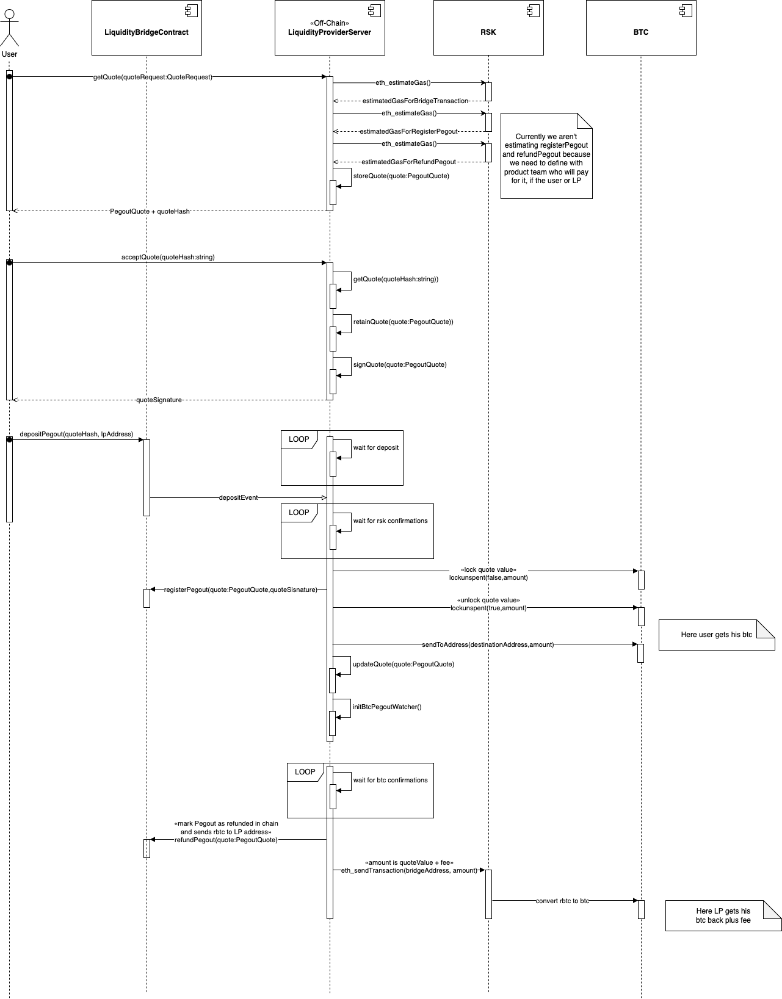

# PegOut Process
This process consist in the conversion of RBTC to BTC. Meaning that tokens will be transferred from RSK network to Bitcoin network. To achieve that, Liquidity Provider Server makes following steps:

* Precondition: the user has executed /pegout/getQuotes endpoint and selected one of the returned quotes
1. The user executes accept quote with the selected quote's hash and LPS responds with the quote signature and LBC's address
2. The user executes the depositPegout function of LiquidityBridgeContract. This triggers an event with the accumulated amount that has been transferred to that quote, which is being watched by LPS
3. When LPS detects the event it checks if the accumulated value is enough (quoteValue + fee) and starts waiting the required confirmations
4. Once the deposit to the RSK address is done and the required confirmations have passed, the LPS checks if the LP has balance available and locks it, then registers the pegout on the LBC and unlocks the balance to send to its destination
5. After sending balance to destination, LPS creates an BTC watcher to check when the required confirmations of the deposit made in previous step have passed
6. When deposit confirmations have passed, LPS calls refundPegout method of LBC to mark quote as finished and verify and punish LP if necessary 
7. After calling refundPegout and do the proper verifications, LPS sends RBTC to the bridge to convert it to BTC, refunding LP and giving him his fee 

Here is a diagram of the whole process
