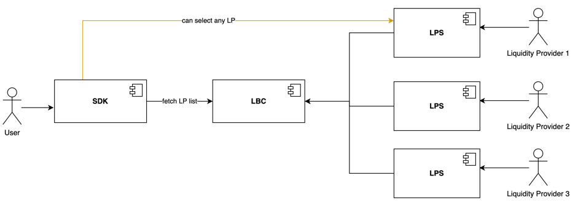
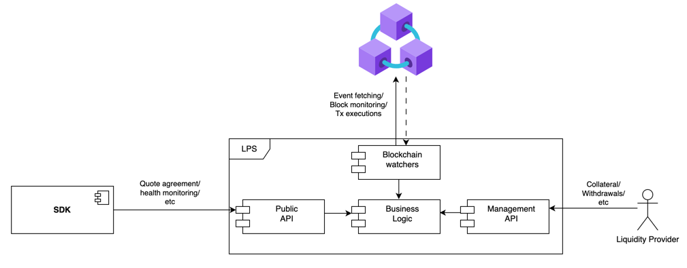

# Liquidity Provider Server - Liquidity Provider specification
The intent of this document is to explain all the points that the liquidity provider (LP) should know in order to operate his instance of the liquidity
provider server (LPS).
This document contains both technical and non-technical information, so it is recommended to be reviewed by the LP itself and the person who is in change of 
setting up the environment where the LPS is going to be deployed.

## Table of contents
- [Context](#context)
- [LPS Configuration](#lps-configuration)
  - [Management UI Access](#management-ui-access)
- [Minimum Security Requirements](#minimum-security-requirements)
- [Wallet Management](#wallet-management)
  - [Local wallet](#run-lps-using-local-wallet-integration)
  - [FireBlocks wallet](#run-lps-using-fireblocks-service-integration)
- [Secrets management](#secrets-management)

### Reading as liquidity provider
If you are a liquidity provider, and you're not interested in the technical details then the following sections are the ones of your main interest:
- [Management UI Access](#management-ui-access)
- [Wallet Management](#wallet-management)

## Context
In the Flyover Protocol, there are two main actors, the regular user (user), who is party interested in executing Peg-In/Peg-Out operations and the Liquidity 
Provider (LP), who puts liquidity to speed up the operation for the user in exchange for a fee as a reward. In order to do this, the user and the LP need to 
agree on the terms of the service (a Peg-In/Peg-Out *Quote*). This implies that the different LPs may offer different quotes, so the user needs to be able to
communicate with each one of the LPs to decide which one is going to use for the operation.

The user interacts with the Flyover Protocol through the [Flyover SDK](https://github.com/rsksmart/unified-bridges-sdk/tree/main/packages/flyover-sdk). This 
SDK fetches the list of the available LP from the liquidity bridge contract (LBC), this contract returns a list where each element has some information about
the LP, among this information will be the URL of the liquidity provider server (LPS) instance of that LP so the user can communicate with it. This means 
that **the LPS has an API that every user interacts with to do the quote agreement**.

The LP also needs to interact with the protocol to perform some management operations related to topics such as collateral, funds, fees management, configuration, 
etc. The LP does this operation through the LPS, that's the reason why the LPS also has an API that the LP interacts with to perform various management operations.

To summarize, the LPS has two main APIs:
- **User/Public API**: This API is used by the user to interact with the LP to agree on a quote.
- **LP/Management API**: This API is used by the LP to interact with the LPS to perform management operations.

    

If we zoom in on one LPS:

    

The fact that LPS' API is divided in a public one and a private one implies that the Management API has some security requirements that need to be addressed in order
to ensure that it will be only used by the LP. Some of these measures are provided out of the box by the LPS but some others require additional configuration for the
environment where the LPS will run.

## LPS Configuration
By default, the Management API is disabled, and it can be enabled only by setting the `ENABLE_MANAGEMENT_API` environment variable to `true`. This is a security measure
to ensure that the API will only be accessible if it is explicitly enabled by the LP (or the person setting up the environment).

Once this variable is set to true **it is responsibility of the LP and the person setting up the environment to ensure that the API is properly secured**. 

### Management UI Access
The LPS provides a Management UI out of the box to facilitate the interaction with the Management API. To go to that UI you just need to go to
`<LPS URL>/management` page in your browser.

In order to interact with this API, the LP needs to be authenticated. The authentication mechanisms consists in user/password credentials. There is a default credentials
pair which is `admin` as username and a random password that the LPS will generate on its startup in the file `management_password.txt` inside the temporal directory 
of your OS. E. g.: `/tmp/management_password.txt`.

The first time that the LP enters the Management UI he will be asked to provide the default credentials and set the new ones to use from that point to the future.
After logging in, the LP will have access to all the operations of the Management API.

> :warning: Remember that if `ENABLE_MANAGEMENT_API` is set to false, the Management UI won't be accesible.

TODO: complete this screenshots of the UI once its finished.

## Minimum security requirements
The full detail of the endpoints and how to call them can be found in the [OpenAPI file](../OpenApi.yml) of the LPS, the following list contains a short description of each endpoint and
whether it should be treated as public or secured as a private endpoint.

- PUBLIC: accessible by anyone
- PRIVATE: only accessible by LP
- ANY: is up to the administrator to set it as private or public

|         **Endpoint**          | **Method** | **Visibility** |                   **Description**                   |
|:-----------------------------:|:----------:|:--------------:|:---------------------------------------------------:|
|            /health            |    GET     |      ANY       |                    Health check                     |
|         /getProviders         |    GET     |     PUBLIC     |             Get list of registered LPs              |
|      /providers/details       |    GET     |     PUBLIC     |      Get details of the LP that owns this LPS       |
|        /pegin/getQuote        |    POST    |     PUBLIC     |                Get pegin quote terms                |
|      /pegin/acceptQuote       |    POST    |     PUBLIC     |              Accept pegin quote terms               |
|       /pegout/getQuotes       |    POST    |     PUBLIC     |               Get pegout quote terms                |
|      /pegout/acceptQuote      |    POST    |     PUBLIC     |              Accept pegout quote terms              |
|         /pegin/status         |    GET     |     PUBLIC     |  Get details and status of an accepted pegin quote  |
|        /pegout/status         |    GET     |     PUBLIC     | Get details and status of an accepted pegout quote  |
|     /providers/liquidity      |    GET     |     PUBLIC     |         Get liquidity available in this LPS         |
|       /pegin/collateral       |    GET     |    PRIVATE     |        Get collateral locked by LP for pegin        |
|      /pegout/collateral       |    GET     |    PRIVATE     |       Get collateral locked by LP for pegout        |
|     /pegin/addCollateral      |    POST    |    PRIVATE     |              Lock collateral for pegin              |
|     /pegout/addCollateral     |    POST    |    PRIVATE     |             Lock collateral for pegout              |
| /providers/withdrawCollateral |    POST    |    PRIVATE     | Withdraw collateral locked for both pegin & pegout  |
|    /providers/changeStatus    |    POST    |    PRIVATE     |     Change status of the LP that owns this LPS      |
|    /providers/resignation     |    POST    |    PRIVATE     |        Resign as flyover liquidity provider         |
|          /userQuotes          |    GET     |     PUBLIC     |     Get list of pegout deposits made by a user      |
|        /configuration         |    GET     |    PRIVATE     |          Get the configuration of this LPS          |
|        /configuration         |    POST    |    PRIVATE     |    Modify the general configuration of this LPS     |
|     /pegin/configuration      |    POST    |    PRIVATE     | Modify the pegin related configuration of this LPS  |
|     /pegout/configuration     |    POST    |    PRIVATE     | Modify the pegout related configuration of this LPS |
|       /management/login       |    POST    |    PRIVATE     |             Login to the Management API             |
|      /management/logout       |    POST    |    PRIVATE     |           Logout from the Management API            |
|    /management/credentials    |    POST    |    PRIVATE     |     Update credentials for Management API login     |
|          /management          |    GET     |    PRIVATE     |                 Serve Management UI                 |

## Wallet management
The LPS performs operations in behalf of the LP during the process of the protocol, it means that it requires access to both LP's Bitcoin and
Rootstock wallets. To be more specific, it requires access to the RSK wallet of the LP and by having it, it also has access to the BTC wallet
associated with that RSK wallet.

The LPS has the following options to be provided with the access of that wallet, and depending on the option picked by the LP (set with 
the value of the `WALLET` environment variable), the LP will need to manage those wallets in a different way:

### Run LPS using local wallet integration
With this option the LPS needs access to the [keystore file](https://ethereum.org/en/glossary/#keystore), of the wallet and the password to decrypt it.
There are multiple ways to provide this information to the LPS and can be checked in the [secret management section](#secrets-management).

With this, the LPS would keep in memory the wallet and sign the Rootstock and Bitcoin transactions with it. It's important to notice that with this
approach the knowledge of the private key is inside the organization running the LPS.

Regarding the LP, through the Management UI the LPS allows the LP to perform all the necessary operations related to the protocol, and regarding the wallet
itself, the LPS informs both RSK and BTC addresses that the LP should transfer to in order to add liquidity to the wallets.

If the LP wants to perform any additional operations **non-related to Flyover protocol** in the RSK network, then he needs to get the keystore file and password and
import the account to a wallet of its choice such as MetaMask (in the case of MetaMask by following [these steps](https://support.metamask.io/managing-my-wallet/accounts-and-addresses/how-to-import-an-account/)).
In the case that the LP wants to perform any additional operations **non-related to Flyover protocol** in the BTC network then he needs to export the private key of
the account (in the case of MetaMask by following [these steps](https://support.metamask.io/managing-my-wallet/secret-recovery-phrase-and-private-keys/how-to-export-an-accounts-private-key/))
and convert it to wallet import format (WIF) and then import it to any wallet of its choice as explained in [Rootstock developer portal](https://dev.rootstock.io/rsk/rbtc/conversion/networks/).

### Run LPS using FireBlocks service integration
The FireBlocks integration will be included in the next release, this integration allows to run the LPS without the need to have the private keys inside the organization's
environment and also will provide the LP with a UI to manage those wallets since its a custodial service.

#### Technical clarifications
Regardless of the option chosen by the LP to handle the wallet management, the LPS will require to create the following watch-only wallets in the
BTC node, so we advise ensuring that the node doesn't have other wallets with the same names to avoid errors on the startup:

- `rsk-wallet`: this wallet will be used to track the UTXOs available to spend with the LP wallet. It requires a rescan of the network, and it only
imports the LP public key on the first start of the LPS, after that, it just validates that the wallet is created abd the public key is imported
- `pegin-watchonly-wallet`: this wallet will be used to track the deposit addresses of the accepted PegIn operations. It doesn't require rescan, and
it imports a new address every time a PegIn is accepted.

**It's important to clarify that the LPS expects that none of these wallets is encrypted. There is no security risk on this since they handle only
public information**

## Secrets Management
For every wallet management option there will be some secrets involved, even if those secrets are the private keys or not. This section explains all
the ways that the LPS has to be provided with those secrets.

The option to select of the following can be set through the value of the `SECRET_SRC` environment variable:

### Environment (Not recommended)
In this option the LPS will get the required secrets from the environment (this might include the path to existing files in the filesystem). This option
is not recommended to be used in productive environments as it was developed only for testing purposes. The env vars that need to be set if this option
is used are the following:
- `KEYSTORE_FILE`
- `KEYSTORE_PWD`

### AWS Secrets Manager
In this option the LPS will get the secrets from AWS secrets manager service, this means that the LPS will need to be provided with the AWS keys in any
of the ways that the AWS client allows (through a file in home directory, environment variables, etc). In this case, the LPS should receive the name of
the secrets to use through the environment variables (that are listed below). This is the recommended option for productive environments.
- `KEY_SECRET`
- `PASSWORD_SECRET`

